출처 : https://pikuma.com/courses/learn-3d-computer-graphics-programming

# 3D Graphics 

메모리 / 디스플레이 / 그래픽스

- simple 
- fast 
- portable -> javascript or python


## SDL

### why?

**SDL**의 가장 큰 장점은 멀티 플랫폼을 지원하며, 하나의 소스코드로 여러가지 플랫폼에서 컴파일이 가능하다는 것입니다. 즉, 크로스 플랫폼(Cross-Platform) 멀티미디어 라이브러리인 셈입니다


## Color Buffer

```c
// pointer to an array of uint32 elements
uint32_t* color_buffer = NULL;
```

윈도우 설정시 width *  height 개수 만큼 픽셀 존재

버퍼의 각 요소가 uint32 elements


## memory allocation

```c
void setup(void) {
    // Allocate the required bytes in memory for ther color buffer
    color_buffer = (uint32_t*) malloc(sizeof(uint32_t) * window_width * window_height);
}
```


```c
// first pixel to Red
color_buffer[0] = 0xFFFF0000;

// first pixel to Green
color_buffer[1] = 0xFF00FF00;

// pixel at row 10 column 20 Red로 설정
color_buffer[(window_width * 10) + 20] = 0xFFFF0000;
```


# Vectors

- velocity
- Acceleration
- force
- lift
- DRAG
- displacment


## REPRESENTING 2D POINTS

## REPRESENTING 3D POINTS

3 components

X, Y, Z

vertex -> vector 

큐브는 백터의 집합

```c
typedef struct {
    float x;
    float y;
} vec3_t;
```


# Projection


## orthographic projection

- parallel projection - z를 무시
- The orthographic projection simply discards the z component of the points and projects the vectors in the 2D (x,y) position. This gives no sense of depth.

## perspective projection

You'll see that perspective projection is different because we want points that are closer to appear bigger and points that are far away to appear smaller. For that we divide both x and y by the z component.

### perspective divide

- Coordinate system
  - left
    - DirectX
  - right
    - OpenGL


## Vector transformation

FOV, aspect Ratio


```c
process_input(void);
```

---------------

```c
void update()
{
    transform_points();
    // rotate
    // scale
    // translate
    
    project_points(perspective);
}
```

-----------

```c
void render(void)
{
    draw_projected_points();
}
```


# Linear Transformation
## TRIGONOMETRY

## vector rotation function

## proof of angle sine addition

## proof of angle cos addition


# Fixed Game loop

machine 성능에 따라 렌더링 속도가 달라짐

FPS : frame per second 


# Triangle and vertices

## meshes


# Line drawing

## Rasterizing Lines

## line Drawing Algorithm

### DDA 

easy to understand

```c
void draw_line(int x0, int y0, int x1, int y1, uint32_t color)
{
	int delta_x = (x1 - x0);
	int delta_y = (y1 - y0);

	int side_length = abs(delta_x) >= abs(delta_y) ? abs(delta_x) : abs(delta_y);

	float x_inc = delta_x / (float)side_length;
	float y_inc = delta_y / (float)side_length;

	float current_x = x0;
	float current_y = y0;

	for (int i = 0; i <= side_length; i++)
	{
		draw_pixel(round(current_x), round(current_y), color);
		current_x += x_inc;
		current_y += y_inc;
	}
}
```


### Bresenham

super fast

성능상 좋으나 좀 더 어려움 / DDA 성능이 떨어지면 필요시에 사용할 것임


# OBJ Files

v1/ vt1/ vn1 

vertex / vertex texture / vertex normal 

f : face


pixel by pixel 

unity render / rotate / translate

GameLoop


**Exporting OBJ Files as "Quads" or "Triangles"**

Very often you will find OBJ files that were exported as *quads* (4 vertices per face) instead of *triangles* (3 vertices per face).

Most 3D modelling software (Blender is a popular example) can export and convert from quads to triangles and vice-versa. The person exporting the OBJ file just needs to remember to check the option "convert quads to triangles" when they are exporting the 3D model from Blender.

Just keep in mind that different OBJ files can be encoded differently. The OBJ files that I used for this course are all exported as triangles.


# Vector Operations

## Backface culling


## Vector magnitude

## Vector SUB , ADD

## Cross product

면적 

방향

의미

## Finding the normal Vector using Cross Product


## Dot product

// how aligned are two vectors each other
// a.b = 1 평행
// a.b < 0 
// a.b = 0 수직
// a.b < 0 


**Vector Length & Dot Product Values**

We just saw an example where the *dot product* between vectors ***a\*** and ***b\*** equals to 1.0 when the two vectors are perfectly parallel to each other and pointing at the same direction.

Just a friendly reminder that this is only true when both ***a\*** and ***b\*** are **unit vectors** (their length is 1.0).

In reality, the magnitude of the *dot product* can assume values greater than 1. The result of the dot product depends always on the result of the projection.


Still, the rule that the dot product is positive if they point in the same direction and negative if they point away from each other is always true, regardless of how long the vectors are.

Very soon you’ll see an example of a problem where we’ll have to enforce that the length of the vectors that are being “dotted” is always 1.0.

But don’t worry. As we start using the dot product more and more I promise that this will all become second nature. That’s why we’re here!


## Culling Algorithm

1. Find vectors B-A and C-A
2. Take their cross product and find the perpendicular normal N
3. Find the camera ray vector by substracting the camera position from point A ( camera - A)

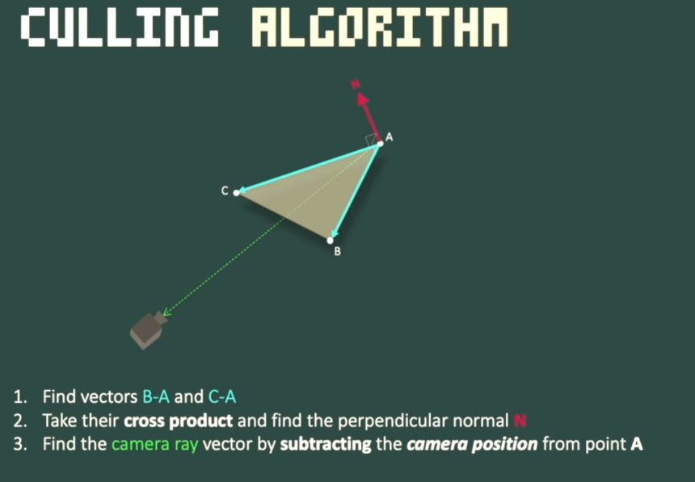 

4. Take the Dot product between the normal and the camera ray
5. if this dot product is less than zero, then do not display the face


```c
// Loop all faces

for(f in faces[])
{
    // Loop all 3 vertices to perform transformations
    for (1...3) 
    {
        
    }
    
    // TODO : perform backface culling
        
    // Loop all 3 vertices to perform projection
    for (1..3)
    {

    }
}
```


Look, what we just did was super cool and it works for our current 3D project as it is. But, you'll see that modern graphics APIs and modern 3D hardware might approach back-face culling differently. For example, OpenGL does not compare the normal of the faces with the camera; instead, it does back-face culling **after** *projection* and uses the clockwise/counterclockwise order of the vertices to determine what is visible and what's not.

Since this is supposed to be a beginner-friendly course, I believe the normal/camera comparison is a great place to start thinking about these ideas. It will work well, especially now that our objects are mostly in the center of the system and our camera is at the origin. But we might revisit this code once we implement 3D camera movement.

So, I just want you to be aware that modern 3D graphics can use smarter algorithms and they try to optimize things in the pipeline. We'll come back to discuss more about GPUs and modern graphics APIs soon.


# Triangle Rasterization

## Triangle FILL

## Scanline FILL

## Flat-top + Flat-bottom Technique

어떤 꼭지점이 위인지 알아야 함

sort our vertices

top y0 < y1 < y2 bottom

find division point (Mx, My)

first goal is find the Mx, My

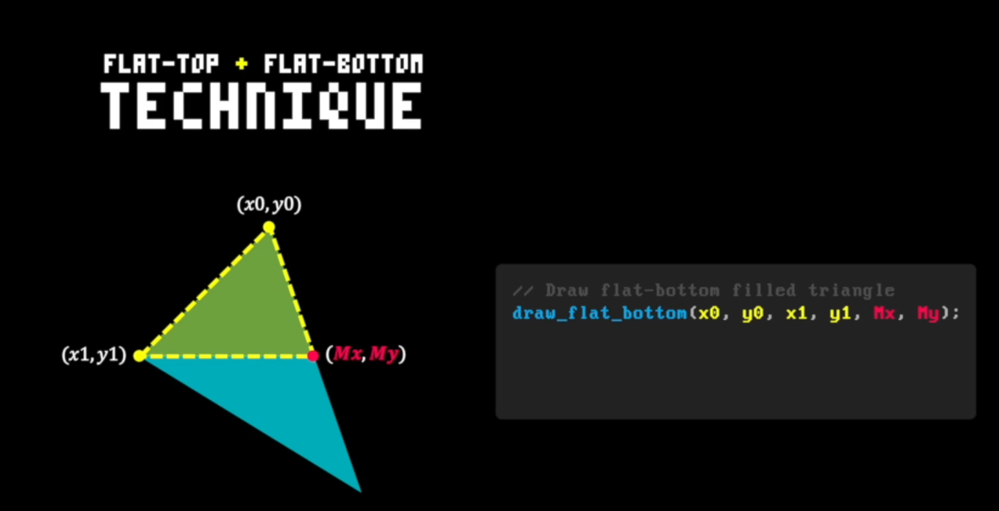 

 

```c
// draw flat bottom filled triangle
draw_flat_bottom(x0, y0, x1, y1, Mx, My);

// draw flat top filled triangle
draw_flat_top(x1, y1, Mx, My, x2, y2);
```


## 삼각형 닮음으로 좌표찾기

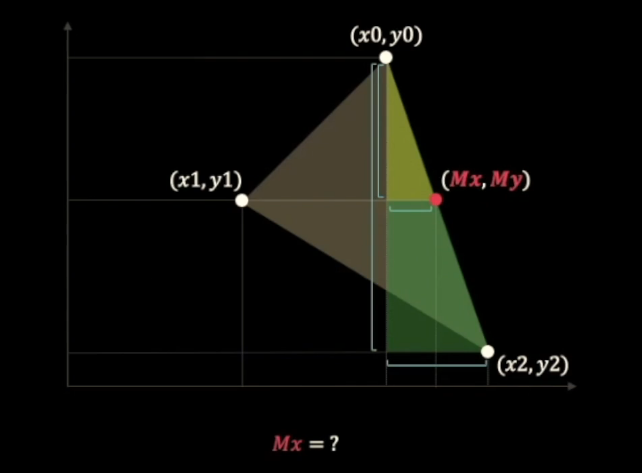 


$$
\frac {Mx - x0}{x2-x0} = \frac {y1 - y0}{y2-y0} \\
(Mx - x0)(y2-y0) = (x2-x0)(y1 - y0) \\
Mx - x0 = \frac {(x2-x0)(y1 - y0)}{(y2-y0)} \\
\therefore Mx = \frac {(x2-x0)(y1 - y0)}{(y2-y0)} + x0
$$


## flat-bottom triangle algorithm

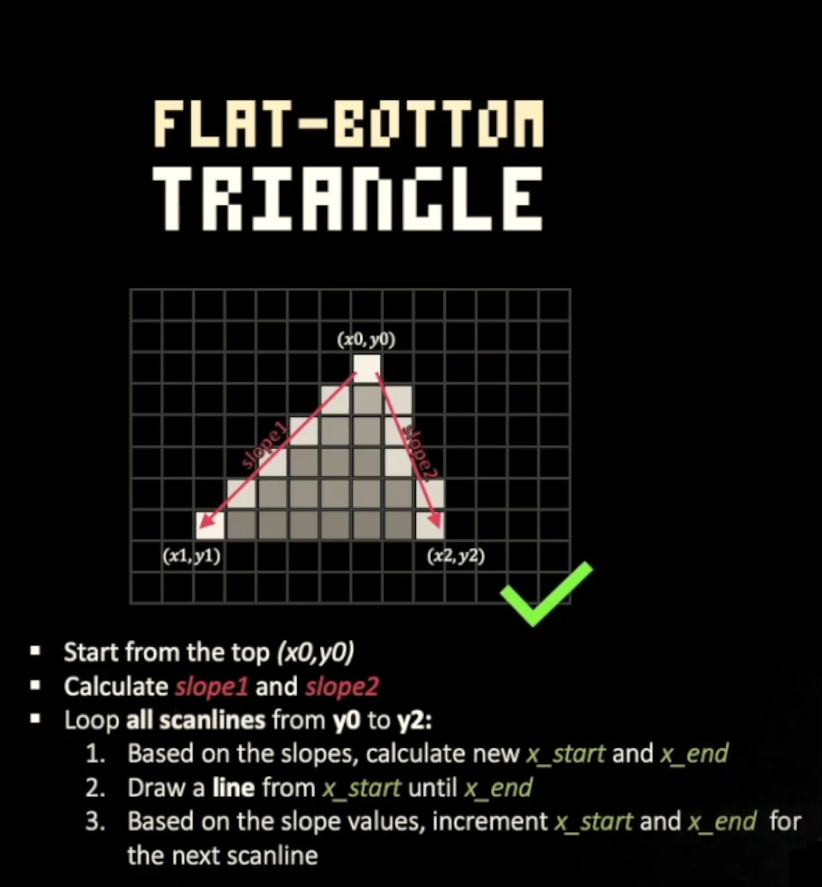 


### Inverse of slope

 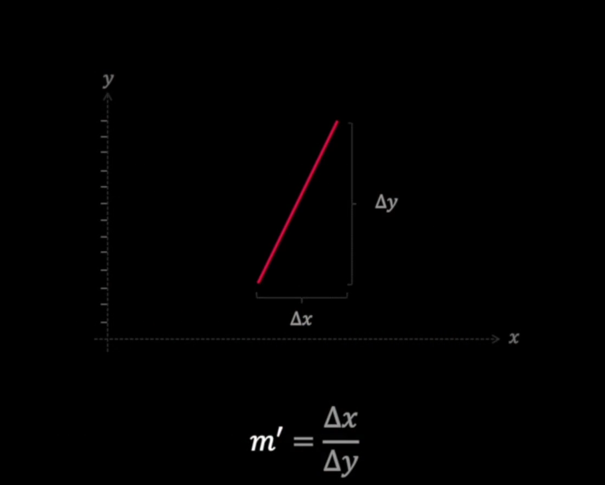

x의 변화량을 구하므로 dy가 분모가 되도록 기울기의 역을 구해야 함 


### 결과

 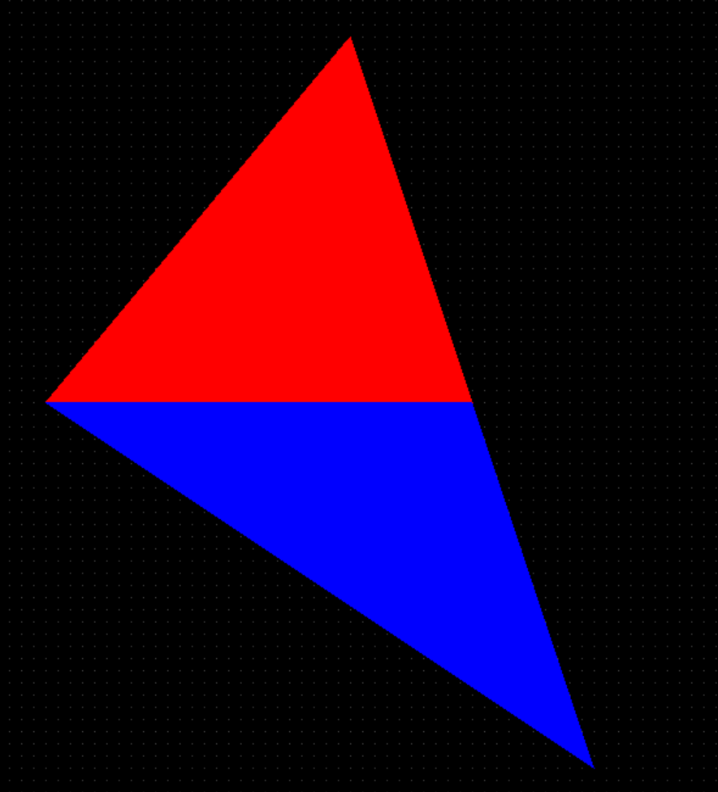

결과를 메시 삼각형 그리기에 적용하여 색 채워주기 가능


## Avoiding Division by zero

```c
// Avoiding division zero
if (y1 == y2)
{
    // 밑에 삼각형이 없는 경우
    fill_flat_bottom_triangle(x0, y0, x1, y1, x2, y2, color);
}
else if (y0 == y1)
{
    // 위에 삼각형이 없는 경우
    fill_flat_top_triangle(x0, y0, x1, y1, x2, y2, color);
}
else
{
    // Caculate the new vertex (Mx, My) using triangle similarity
    int My = y1;
    int Mx = ((float)((x2 - x0) * (y1 - y0)) / (float)(y2 - y0)) + x0;

    // Draw flat-bottom triangle
    fill_flat_bottom_triangle(x0, y0, x1, y1, Mx, My, color);

    // Draw flat-top triangle
    fill_flat_top_triangle(x1, y1, Mx, My, x2, y2, color);
}
```

- 예외처리


## Colored Triangle Faces

- 문제점
  - 뒷면이나 옆면이 앞면보다 먼저 렌더링되는 경우가 생겨서 부자연스러운 화면 출력이 나타남
- 해결 방법?
  - depth에 따른 triangle face를 sort해줘야 함
  - 그 다음 뒤에서부터 앞까지 렌더링
- z-buffer
  - decide what's render first
- Painter's Algorithm
  - order of faces


By *looking down* as much as possible during a level, we reduce the number of objects that need to be displayed, and consequently, the game manages to run smoothly (faster).

So, I just wanted to mention this fun fact here because I think it links well with the idea that the more triangles we render, the more we'll need from the hardware. And this is especially true for *software* renderers, where all the rendering and all graphics computations are performed **linearly** (one instruction at a time) by the CPU.


# Sorting Faces by Depth


## Painter's Algorithm

무엇을 그릴 때 뒷바탕을 먼저 그리고 점점 위에 그림을 그려감 (back to front)

 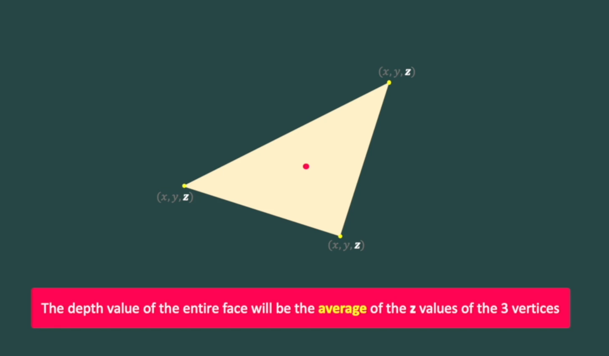

depth of face , z of face

the depth value of the entire face will be the average of the z values fo the 3 vertices
$$
avgDepth = \frac {z1 + z2 + z3} {3}
$$
avgDepth로 정렬하여 렌더링 파이프라인에 넘겨줌


# Matrices

왜 유용함?

Linear System -> Augmented Matrix

- Rotation
- Translation
- Scaling
- Projection

converts sets of geometric data(vertices) into different coordinate systems.

ex) 행렬 곱은 이동, 회전 , 투영, 다른 많은 변환에 대해 표현하게 해줌

- numerical version ->
  - manual version
  - 
-  matrix version
  - elegant version


## Matrix operations 

`CORE OF COMPUTER GRAPHICS`

- ADD
- SUB
- ★MUL
  - Dot product


## Matrix multiplication

- (N x M ) * ( M x P)  = N x P
- not commutative (교환법칙 X)


## Identity Maxtrix

- 단위행렬
- 라이브러리에서 `eye` 로 표현하기도 함


## 2D Rotation Matrix

$$
\begin{bmatrix} x' \\ y'\end{bmatrix} = \begin{bmatrix} cosα & -sinα\\ sinα & cosα\end{bmatrix} *\begin{bmatrix} x \\ y\end{bmatrix}
$$

$$
= \begin{bmatrix} xcosα-ysinα\\ xsinα + ycosα\end{bmatrix}
$$


## 3D Transformation Matrice

- 선형대수에서 선형이동(linear tranformation)은 행렬로 표현할 수 있다.
-  3D tranformation에 4 X 4 행렬을 이용한다.(scale , translation , rotation, etc)

$$
\begin{bmatrix} m&m&m&m\\m&m&m&m\\m&m&m&m\\m&m&m&m\end{bmatrix}= \begin{bmatrix} x\\y\\z\\w\end{bmatrix}
$$

- 4 X 4
  - translation require an extra row/column to be perfomed
  - To enable matrix-vector mulitplication, an extra component w is added to our original vector ( for now, think of w as being 1). 
  - 4 x 4 행렬을 사용하는 이유 : Translation 


## Scale Matrix

$$
\begin{bmatrix} sx&0&0&0\\0&sy&0&0\\0&0&sz&0\\0&0&0&1\end{bmatrix} * \begin{bmatrix} x\\y\\z\\1\end{bmatrix}
$$

$$
= \begin{bmatrix} sx*x\\sy*y\\sz*z\\1\end{bmatrix}
$$

## Translation Matrix

$$
\begin{bmatrix} 1&0&0&tx\\0&1&0&ty\\0&0&1&tz\\0&0&0&1\end{bmatrix} * \begin{bmatrix} x\\y\\z\\1\end{bmatrix}
$$

$$
= \begin{bmatrix} x+0+0+tx\\0+y+0+ty\\0+0+z+tz\\0+0+0+1\end{bmatrix}
$$

$$
= \begin{bmatrix} x+tx\\y+ty\\z+tz\\1\end{bmatrix}
$$

4 x 4 행렬을 사용하는 이유 : Translation 


## Rotation Matrices


### Rotation Z 

Z는 고정되므로 Z축 회전
$$
\begin{bmatrix} cos(α)&-sin(α)&0&0\\sin(α)&cos(α)&0&0\\0&0&1&0\\0&0&0&1\end{bmatrix} * \begin{bmatrix} x\\y\\z\\1\end{bmatrix}
$$

### Rotation X

$$
\begin{bmatrix} 1&0&0&0\\0&cos(α)&-sin(α)&0\\0&sin(α)&cos(α)&0\\0&0&0&1\end{bmatrix} * \begin{bmatrix} x\\y\\z\\1\end{bmatrix}
$$

### Rotation Y

$$
\begin{bmatrix} cos(α)&0&sin(α)&0\\0&1&0&0\\-sin(α)&0&cos(α)&0\\0&0&0&1\end{bmatrix} * \begin{bmatrix} x\\y\\z\\1\end{bmatrix}
$$

counter clock wise

we want to keep orientation and direction of the rotation Counterclockwise of everything.

this is formal rotation of y where we kind of keep this clockwise.

counter clock wise X, Z

 just keep the direction correctly for everything we have to kind of change clockwise one in Y


https://courses.pikuma.com/courses/take/learn-computer-graphics-programming/texts/28464920-3d-rotation-direction-handedness


## Translation is not a Linear transformation

- 선형 변환의 조건
  - 선분으로 시작
  - result a line
  - 원점이 변하지 않음
- 선형변환
  - rotation
  - scale
  - shear


이동은 선형 변환이 아님!

이동은 원점이 변하게 됨


따라서 

1. Scale
2. Rotate
3. Translate

- SRT 순서로 계산해줘야 함!
- T * R* S * v


4 X 4 행렬이 필요한 이유 : 

The result of a shear in 3D is a translation in the 2D plane

The result of a shear in 4D is a translation in the 3D plane


# Projection Matrix

- Orthogonal
- Perspective


## Resposible for

- Aspect ratio : 스크린 넓이와 높이에 따라 x와 y값 조절
  - a = h / w
- Field of view : Fov angle에 따라 xy값 조절
- Normalization : NDC xyz값을 -1에서 1로 변환

투영 행렬은 모든 화면, 해상도, fov 및 znear/zfar 값과 함께 작동하도록 투영 단계를 일반화하는 것입니다.

https://docs.microsoft.com/en-us/windows/win32/direct3d9/d3dxmatrixperspectivefovlh


## Row major and Column major

## Column major

$$
\begin{bmatrix} x\\y\\z\\w\end{bmatrix}
$$

- 4 x 1
- 4 x 4 * 4 x 1
- OpenGL
- Column major order

$$
\begin{bmatrix} 1&0&0&tx\\0&1&0&ty\\0&0&1&tz\\0&0&0&1\end{bmatrix} * \begin{bmatrix} x\\y\\z\\1\end{bmatrix} = \begin{bmatrix} x'\\y'\\z'\\1\end{bmatrix}
$$


## Row major

$$
\begin{bmatrix} x & y& z& w\end{bmatrix}
$$

- 1 x 4
- 1 x 4 * 4 x 4
- DirectX
- Row major order

$$
\begin{bmatrix} x &y &z & 1\end{bmatrix} * \begin{bmatrix} 1&0&0&0\\0&1&0&0\\0&0&1&0\\tx&ty&tz&1\end{bmatrix} = \begin{bmatrix} x'&y'&z'& 1\end{bmatrix}
$$

- As a summary, if we want to:

  1. First Rotate around the y-axis
  2. Then Rotate around the z-axis
  3. Then Translate using matrix T

  We will have to perform the following order of multiplications:

  - In **row-major ** : *P' = P \* Ry \* Rz \* T*
  - In **column-major ** : *P' = T \* Rz \* Ry \* P*


# Light and Shading


Global Lighting 

```c
typedef struct
{
    vec3_t direction;
} light_t;
```

- all the lights are coming from one direction 
- like SUN
- 따라서 position없음


## Flat shading

- how aligned light ray and face normal is.
- Global Lighting에서 쏜 ray가 삼각형 표면의 노멀과 얼마나 평행한지에 따라 빛의 양을 계산
- 얼마나 평행한지 내적을 이용


## CODE

```c++
light_t g_light = { .direction = { 0, 0, 1} };

uint32_t light_apply_intensity(uint32_t original_color, float percentage_factor)
{
    // clamp
    if (percentage_factor < 0) percentage_factor = 0;
    if (percentage_factor > 1) percentage_factor = 1;

    uint32_t a = (original_color & 0xFF000000);
    uint32_t r = (original_color & 0x00FF0000) * percentage_factor;
    uint32_t g = (original_color & 0x0000FF00) * percentage_factor;
    uint32_t b = (original_color & 0x000000FF) * percentage_factor;

    uint32_t new_color = a | (r & 0x00FF0000) | (g & 0x0000FF00) | (b & 0x000000FF);

    return new_color;
}

// how aligned are two vectors each other
// a.b = 1 평행
// a.b > 0 
// a.b = 0 수직
// a.b < 0 
float light_intensity_factor(vec3_t normal)
{
     // g_light를 수정하지 않고
     // 빛의 방향을 반대로 하기 위해 음수를 반환
	return -vec3_dot(normal, g_light.direction);
}
```


# Texture mapping


```c++
#include <stdio.h>
#include "texture.h"

int texture_width = 64;
int texture_height = 64;

uint32_t* mesh_texture = NULL;

const uint8_t REDBRICK_TEXTURE[] = {
    0x38, 0x38, 0x38, 0xff, 0x38, 0x38, 0x38, 0xff, 0x38, 0x38, 0x38, 0xff, 0x38, 0x38, 0x38, 0xff, 0x38, 0x38, 0x38, 0xff, 0x38, 0x38, 0x38, 0xff, 0x38, 0x38, 0x38, 0xff, 0x38, 0x38, 0x38, 0xff, 0x38, 0x38, 0x38, 0xff, 0x38, 0x38, 0x38, 0xff, 0x38, 0x38, 0x38, 0xff, 0x38, 0x38, 0x38, 0xff, 0x38, 0x38, 0x38, 0xff, 0x38, 0x38, 0x38, 0xff, 0x38, 0x38, 0x38, 0xff, 0x38, 0x38, 0x38, 0xff, 0x38, 0x38, 0x38, 0xff, 0x38, 0x38, 0x38, 0xff, 0x38, 0x38, 0x38, 0xff, 0x38, 0x38, 0x38, 0xff, 0x38, 0x38, 0x38, 0xff, 0x38, 0x38, 0x38, 0xff, 0x38, 0x38, 0x38, 0xff, 0x38, 0x38, 0x38, 0xff, 0x38, 0x38, 0x38, 0xff, 0x38, 0x38, 0x38, 0xff, 0x38, 0x38, 0x38, 0xff, 0x38, 0x38, 0x38, 0xff, 0x38, 0x38, 0x38, 0xff, 0x38, 0x38, 0x38, 0xff, 0x38, 0x38, 0x38, 0xff, 0x38, 0x38, 0x38, 0xff, 0x38, 0x38, 0x38, 0xff, 0x38, 0x38, 0x38, 0xff, 0x38, 0x38, 0x38, 0xff, 0x38, 0x38, 0x38, 0xff, 0x38, 0x38, 0x38, 0xff, 0x38, 0x38, 0x38, 0xff, 0x38, 0x38, 0x38, 0xff, 0x38, 0x38, 0x38, 0xff, 0x38, 0x38, 0x38, 0xff, 0x38, 0x38, 0x38, 0xff, 0x38, 0x38, 0x38, 0xff, 0x38, 0x38, 0x38, 0xff, 0x38, 0x38, 0x38, 0xff, 0x38, 0x38, 0x38, 0xff, 0x38, 0x38, 0x38, 0xff, 0x38, 0x38, 0x38, 0xff, 0x38, 0x38, 0x38, 0xff, 0x38, 0x38, 0x38, 0xff, 0x38, 0x38, 0x38, 0xff, 0x38, 0x38, 0x38, 0xff, 0x38, 0x38, 0x38, 0xff, 0x38, 0x38, 0x38, 0xff, 0x38, 0x38, 0x38, 0xff, 0x38, 0x38, 0x38, 0xff, 0x38, 0x38, 0x38, 0xff, 0x38, 0x38, 0x38, 0xff, 0x38, 0x38, 0x38, 0xff, 0x38, 0x38, 0x38, 0xff, 0x38, 0x38, 0x38, 0xff, 0x38, 0x38, 0x38, 0xff, 0x38, 0x38, 0x38, 0xff, 0x38, 0x38, 0x38, 0xff,
     // .......
     // .......
};
```

- 64 x 64 
- array with hardcoded value


## Barycentric coordinate system (무게 중심 좌표계)

```c++
vec3_t barycentric_weights(vec2_t a, vec2_t b, vec2_t c, vec2_t p)
{
	vec2_t ab = vec2_sub(b, a);
	vec2_t bc = vec2_sub(c, b);
	vec2_t ac = vec2_sub(c, a);
	vec2_t ap = vec2_sub(p, a);
	vec2_t bp = vec2_sub(p, b);

	float area_triangle_abc = (ab.x * ac.y - ab.y * ac.x);

	float alpha = (bc.x * bp.y - bp.x * bc.y) / area_triangle_abc;
	float beta = (ap.x * ac.y - ac.x * ap.y) / area_triangle_abc;
	float gamma = 1 - alpha - beta;

	vec3_t weights = { alpha, beta, gamma };
	return weights;
}
```


- draw_texel
- 무게 중심좌표계를 이용하여 
- 보간된 uv값을 통해 픽셀에 texture의 좌표의 값을 색칠해줌

```c++
void draw_texel(int x, int y, uint32_t* texture, vec2_t point_a, vec2_t point_b, vec2_t point_c, float u0, float v0, float u1, float v1, float u2, float v2)
{
	vec2_t point_p = { x,y };
	vec3_t weights = barycentric_weights(point_a, point_b, point_c, point_p);

	float alpha = weights.x;
	float beta = weights.y;
	float gamma = weights.z;

	// U and V values using barycentric weights
	float interpolated_u = u0 * alpha + u1 * beta + u2 * gamma;
	float interpolated_v = v0 * alpha + v1 * beta + v2 * gamma;

	// Map the UV coordinate to the full texture width and height
	int tex_x = abs((int)(interpolated_u * texture_width));
	int tex_y = abs((int)(interpolated_v * texture_height));
	
	draw_pixel(x, y, texture[tex_x + (tex_y * texture_width)]);
}
```


- 문제점
- 물체를 회전시키면 텍스쳐의 왜곡이 일어남
- 3D 그래픽스의 고전적인 문제점임
- perspective divide를 고려하지 않았음
- Perspective Correct texture를 해줘야함


## Q&A

- ##### cast uint8_t to uint32_t

casting a pointer to another pointer is not changing the format of the data, but how you access the same memory.

So for the current texture, if you read it using a uint8_t pointer, you will 0x38, then 0x38, then 0x38 and 0xFF. But if you access the same memory area with a uint32_t (and we are on a Little Endian CPU like the x86) you will read

0xFF383838 (bytes 0-3), then 0xFF383838 (byte 4-7), 0xFF383838 (byte 8-11), and finally 0xFF383838 (byte 12-15) the "byte X-Y" as the positions in the uint8_t array

Why 0xFF383838 and not 0x383838FF, well that's due to the endianness of the CPU. To store a 32 bits value, you need 4 bytes (4 * 8 bits) and they had to make a choice.

Little endian CPUs store the most significant byte last, Big endian CPU store the most significant byte first. So for that array to be properly read on a 68000 you will need to change the order of the bytes.

And let's not talk about the weird species of CPU known as Middle endian storing bytes in... let's say a weird order!

Order than middle endian, there is no good or wrong way, both are valid, Big Endian allow to read number in a slightly easier way when looking at binary, but other than that, they are both valid approach.

So to resume, casting a pointer do not change the data, just how we access them.


# Perspective Correct textures


## Perspective Correct Interpolation

- 왜곡이 일어남
- 이유는 perspective가 고려되지 않고 선형적으로 mapping 됨
- Affine texture mapping
  - 선형적으로 texture를 mapping
  - PS1에서 텍스쳐들이 perspective가 고려되지 않아 플레이어가 움직이면 빌딩들이 왜곡됨
  - why?
    - Perspective Correct texture mapping은 한 픽셀당 최소 한 번의 나누기가 필요함
    - PS1은 floating-point Unit이 없음!
    - PS1은 depth buffer가 없으므로 그래픽카드에 depth 값을 보내줄 수 없었음
    - 그러므로 Perspective Correct를 적용할 수 없었음
- Perspective Correct 를 적용해야 texture의 왜곡이 일어나지 않음

### perspective is a non-linear transform!

"After our perspective projection is applied, we cannot return back to the value of z using a simple linear equation."

"원근 투영이 적용된 후에는 간단한 선형 방정식을 사용하여 z 값으로 다시 돌아갈 수 없습니다."


- To fix the distortion caused by perspective, we need to find the depth at point P inside the triangle.
- 원근법으로 인한 왜곡을 수정하려면 삼각형 내부의 점 P에서 깊이를 찾아야 합니다.
- but z의 값이 삼각형을 따라 선형이 아니므로 Z를 직접 보간할 순 없음.
- 그러나 Z의 역은 선형임 
- 따라서 p에서 보간된 z의 값을 찾기 위해 1/z를 이용할 것임 


- Algorithm

1. w의 역수를 사용할 것임 (스크린 공간에서 선형)
2. then, we interpolate over the triangle face (using barycentric weights, 1/w factor)
3. finally, we divide all the attribute by 1/w (undoes the perpective transform)

```c++
void draw_texel(int x, int y, uint32_t* texture, 
     vec4_t point_a, vec4_t point_b, vec4_t point_c,
	tex2_t a_uv, tex2_t b_uv, tex2_t c_uv)
{
	vec2_t p = { x, y };
	vec2_t a = vec2_from_vec4(point_a);
	vec2_t b = vec2_from_vec4(point_b);
	vec2_t c = vec2_from_vec4(point_c);

	vec3_t weights = barycentric_weights(a, b, c, p);

	float alpha = weights.x;
	float beta = weights.y;
	float gamma = weights.z;

	// Variables to store the interpolated values of U, V, and also 1/w for the current pixel
	float interpolated_u;
	float interpolated_v;
	float interpolated_reciprocal_w;

	// Perform the interpolation of all U/w and V/w values using barycentric weights and a factor of 1/w
	interpolated_u = (a_uv.u / point_a.w) * alpha + (b_uv.u / point_b.w) * beta + (c_uv.u / point_c.w) * gamma;
	interpolated_v = (a_uv.v / point_a.w) * alpha + (b_uv.v / point_b.w) * beta + (c_uv.v / point_c.w) * gamma;

	// Also interpolate the value of 1/w for the current pixel
	interpolated_reciprocal_w = (1 / point_a.w) * alpha + (1 / point_b.w) * beta + (1 / point_c.w) * gamma;

	// Now we can divide back both interpolated values by 1/w
	interpolated_u /= interpolated_reciprocal_w;
	interpolated_v /= interpolated_reciprocal_w;

	// Map the UV coordinate to the full texture width and height
	int tex_x = abs((int)(interpolated_u * texture_width));
	int tex_y = abs((int)(interpolated_v * texture_height));

	draw_pixel(x, y, texture[(texture_width * tex_y) + tex_x]);
}
```


## What Does "Affine" Mean?

I just used the word "**affine**" when talking about texture mapping.

 An affine transformation is basically a linear transformation + translation.

아핀 변환은 **점, 직선, 평면을 보존하는 선형 매핑 방법**입니다. 아핀 변환 후에도 평행한 선들은 평행한 상태로 유지됩니다. 아핀 변환 기술은 이상적이지 않은 카메라 각도에서 발생하는 기하학적 왜곡이나 형태 변형을 보정하는 데 주로 사용됩니다.


## Perspective Correct paper

There is a paper from 2002 that I really like about the formal derivation of perspective correct interpolation. This academic paper was developed by Kok-Lim Low at the University of North Carolina at Chapel Hill, and it's a rigorous look at the method that I covered in the previous videos.

You don't have to do this now, but you should reserve some time after you complete this course to take a look at the document. It's always good to get familiarized with this style of academic writing, and this is a great example of a very well written paper.

[Kok-Lim Low. 2002. Perspective Correct Interpolation](https://s3.amazonaws.com/thinkific/file_uploads/167815/attachments/c06/b72/f58/KokLimLow-PerspectiveCorrectInterpolation.pdf)


# Decoding PNG Files

library 가져다 씀


# Textured OBJ files

obj file + png file (Texture)

obj file의 각 vertice에서 uv 정보가 아직 없음

obj file에서 vertex의 uv 정보 파싱


## Fixing Texture Buffer overflow & Raster fill Convention

- fill Convention is also known as Triangle Rasterization Rules
- GPU do this job


# Z - Buffer

- depth buffer
- Stores the depth of each screen pixel in an array
- Helps determine what pixel is in front  (should be displayed)
- An alternative to painter's algorithm


1. scene에서 픽셀마다 depth 값을 저장한다면 보간된 z값을 저장해야되나요?
   - No 
2. 만약 z값이 삼각형 면에서 비선형이라면 각각의 픽셀의 depth 값을 어떻게 저장할수 있나요?
   - depth 값의 역으로 저장 (w 값의 역)


## Z-buffer (wiki)

To implement a z-buffer, the old values of z in camera space, or w, are stored in the buffer, generally in [floating point](https://en.wikipedia.org/wiki/Floating_point) format. However, these values cannot be linearly interpolated across screen space from the vertices—they usually have to be [inverted](https://en.wikipedia.org/wiki/Multiplicative_inverse), interpolated, and then inverted again. The resulting values of w, as opposed to z', are spaced evenly between near and far. There are implementations of the w-buffer that avoid the inversions altogether.

Whether a z-buffer or w-buffer results in a better image depends on the application.


## CODE

```c
// Adjust 1/w so the pixels that are closer to the camera have smaller values
interpolated_reciprocal_w = 1.0 - interpolated_reciprocal_w;

// Only draw the pixel if the depth value if less than the one previously stored in the z-buffer
if (z_buffer[(window_width * y) + x] > interpolated_reciprocal_w)
{
     draw_pixel(x, y, texture[(texture_width * tex_y) + tex_x]);

     // Update the z-buffer value with the 1/w of this current pixel
     z_buffer[(window_width * y) + x] = interpolated_reciprocal_w;
}
```

- 


# Camera


## Summary of transformation of 3D game engine

- Local space
- World space
  - multiply by world matrix
- Camera/View space
  - multiply by view matrix
- Screen Space
  - multiply by projection matrix


## Camera Model

- Look-at camera model
  - we are gonna implement this 
  - look at certain target
- FPS camera model


## Look-At Camera Model

- the most popular way of creating a view matrix is using a camera look_at() function
- this function returns a 4X4 matrix that can be used to multiply the vertices to convert them vo view/camera space.
- 카메라의 위치와 방향을 설정하기 위해서는 공간에서 카메라의 위치를 설정하는 포인트(eye 포인트)와 카메라가 바라보는 위치를 정의하는 포인트(target 포인트)만 있으면 됩니다.


## The Look_At Transformation

1. 이동 , translation
   - 카메라의 위치로 이동
2. 회전 , rotation
   - 카메라 방향으로 회전


# Clipping

- The Goal of clipping is to remove objects or line segments that are outside the viewing volume.
- 3D clipping is a set of method to clip polygons against planes
- The Graphis pipeline performs several clipping steps (1 per plane)

- For frustum clipping, we need to clip against six planes
  - top
  - bottom
  - left
  - right
  - near
  - far
- The resulting polygon that is produced as the output of one clipping stage is used as an input for the next stage
- 계산기하
  - 점과 평면과의 관계
  - 선분과 평면
  - 폴리곤과 평면

## Plane

- A plane is be defined by :
  - a point P, and a normal vector n


### Right frustum plane

Question

- What point could we pick to define the right frustum plane?

- what are x,y, and z components of the plane normal vector

  
  
  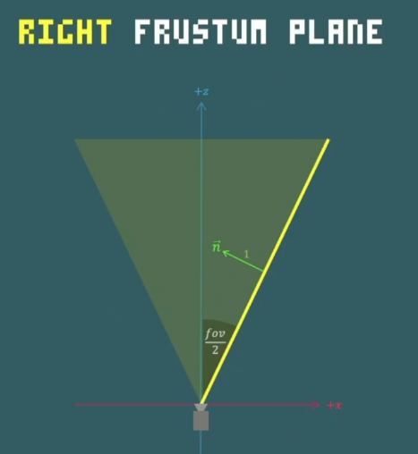 


### CODE

```c
///////////////////////////////////////////////////////////////////////////////
// Frustum planes are defined by a point and a normal vector
///////////////////////////////////////////////////////////////////////////////
// Near plane   :  P=(0, 0, znear), N=(0, 0,  1)
// Far plane    :  P=(0, 0, zfar),  N=(0, 0, -1)
// Top plane    :  P=(0, 0, 0),     N=(0, -cos(fov/2), sin(fov/2))
// Bottom plane :  P=(0, 0, 0),     N=(0, cos(fov/2), sin(fov/2))
// Left plane   :  P=(0, 0, 0),     N=(cos(fov/2), 0, sin(fov/2))
// Right plane  :  P=(0, 0, 0),     N=(-cos(fov/2), 0, sin(fov/2))
///////////////////////////////////////////////////////////////////////////////
//
//           /|\
//         /  | | 
//       /\   | |
//     /      | |
//  P*|-->  <-|*|   ----> +z-axis
//     \      | |
//       \/   | |
//         \  | | 
//           \|/
//
///////////////////////////////////////////////////////////////////////////////
void init_frustum_planes(float fov, float z_near, float z_far) 
{
	float cos_half_fov = cos(fov / 2);
	float sin_half_fov = sin(fov / 2);

	frustum_planes[LEFT_FRUSTUM_PLANE].point = vec3_new(0, 0, 0);
	frustum_planes[LEFT_FRUSTUM_PLANE].normal.x = cos_half_fov;
	frustum_planes[LEFT_FRUSTUM_PLANE].normal.y = 0;
	frustum_planes[LEFT_FRUSTUM_PLANE].normal.z = sin_half_fov;

	frustum_planes[RIGHT_FRUSTUM_PLANE].point = vec3_new(0, 0, 0);
	frustum_planes[RIGHT_FRUSTUM_PLANE].normal.x = -cos_half_fov;
	frustum_planes[RIGHT_FRUSTUM_PLANE].normal.y = 0;
	frustum_planes[RIGHT_FRUSTUM_PLANE].normal.z = sin_half_fov;

	frustum_planes[TOP_FRUSTUM_PLANE].point = vec3_new(0, 0, 0);
	frustum_planes[TOP_FRUSTUM_PLANE].normal.x = 0;
	frustum_planes[TOP_FRUSTUM_PLANE].normal.y = -cos_half_fov;
	frustum_planes[TOP_FRUSTUM_PLANE].normal.z = sin_half_fov;

	frustum_planes[BOTTOM_FRUSTUM_PLANE].point = vec3_new(0, 0, 0);
	frustum_planes[BOTTOM_FRUSTUM_PLANE].normal.x = 0;
	frustum_planes[BOTTOM_FRUSTUM_PLANE].normal.y = cos_half_fov;
	frustum_planes[BOTTOM_FRUSTUM_PLANE].normal.z = sin_half_fov;

	frustum_planes[NEAR_FRUSTUM_PLANE].point = vec3_new(0, 0, z_near);
	frustum_planes[NEAR_FRUSTUM_PLANE].normal.x = 0;
	frustum_planes[NEAR_FRUSTUM_PLANE].normal.y = 0;
	frustum_planes[NEAR_FRUSTUM_PLANE].normal.z = 1;

	frustum_planes[FAR_FRUSTUM_PLANE].point = vec3_new(0, 0, z_far);
	frustum_planes[FAR_FRUSTUM_PLANE].normal.x = 0;
	frustum_planes[FAR_FRUSTUM_PLANE].normal.y = 0;
	frustum_planes[FAR_FRUSTUM_PLANE].normal.z = -1;
}
```


## Defining Points inside and outside planes

- 평면은 3차원 공간을 2면으로 나눈다
  - 위 : inside
  - 아래 : outside
- 어떤 점 Q가 평면 위( On ) 에 있으려면?
  - Q와 평면 위의 점 p의 선분이 p의 노멀벡터와 내적하여 값이 0이 되면 true
- 어떤 점 Q가 평면 안( inside ) 에 있으려면?
  - Q와 평면 위의 점 p의 선분이 p의 노멀벡터와 내적하여 값이 0보다 크면 true
- 어떤 점 Q가 평면 아래( outside) 에 있으려면?
  - Q와 평면 위의 점 p의 선분이 p의 노멀벡터와 내적하여 값이 0보다 작으면 true

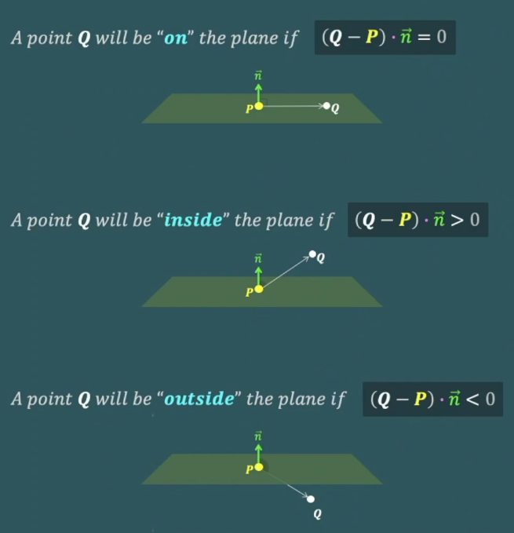 


## Intersection Between Line and Plane

- 폴리곤의 꼭지점들과 평면의 교차점

  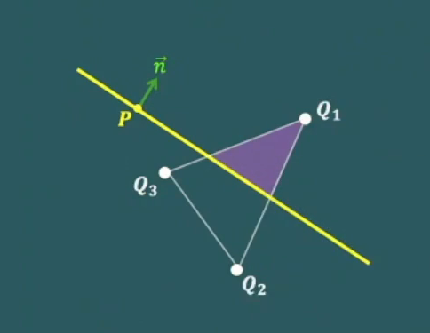 

- 평면과 삼각형위의 선분의 교차점을 찾자
- 선형보간을 이용


 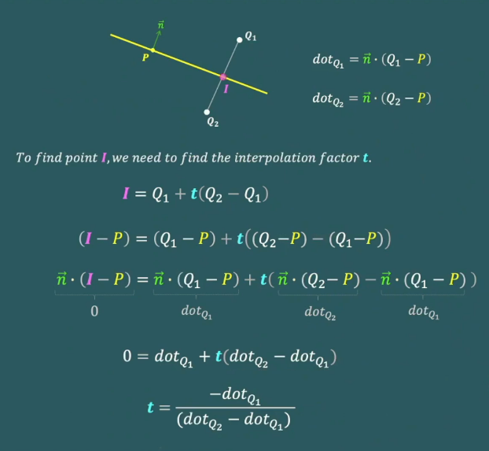 


$$
t = \frac{\vec{n} \cdot (Q_1 - P)}{ \vec{n} \cdot (Q_1 - P) - \vec{n} \cdot (Q_2 - P)} \\
t = \frac{dot_{Q1}}{dot_{Q1} - dot_{Q2}}
$$


- t를 구하면 충돌점을 구할 수 있다
  - point = origin + t * direction
  - point = Q1 + t ( Q2 - Q1 )


## Clipping a polygon Against a plane

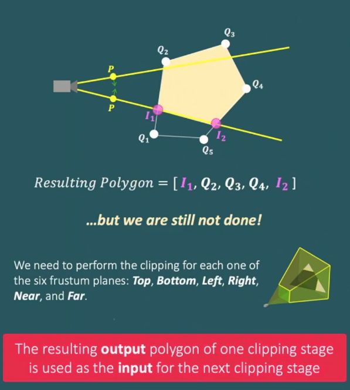 

### code 

```c
void clip_polygon_against_plane(polygon_t* polygon, int plane) 
{
    vec3_t plane_point = frustum_planes[plane].point;
    vec3_t plane_normal = frustum_planes[plane].normal;

    // Declare a static array of inside vertices that will be part of the final polygon returned via parameter
    vec3_t inside_vertices[MAX_NUM_POLY_VERTICES];
    int num_inside_vertices = 0;

    // Start the current vertex with the first polygon vertex, and the previous with the last polygon vertex
    vec3_t* current_vertex = &polygon->vertices[0];
    vec3_t* previous_vertex = &polygon->vertices[polygon->num_vertices - 1];

    // Calculate the dot product of the current and previous vertex
    float current_dot = 0; 
    float previous_dot = vec3_dot(vec3_sub(*previous_vertex, plane_point), plane_normal);

    // Loop all the polygon vertices while the current is different than the last one
    while (current_vertex != &polygon->vertices[polygon->num_vertices]) {
        current_dot = vec3_dot(vec3_sub(*current_vertex, plane_point), plane_normal);

        // If we changed from inside to outside or from outside to inside
        if (current_dot * previous_dot < 0) {
            // Find the interpolation factor t
            float t = previous_dot / (previous_dot - current_dot);
            // Calculate the intersection point I = Q1 + t(Q2-Q1)
            vec3_t intersection_point = vec3_clone(current_vertex);              // I =        Qc
            intersection_point = vec3_sub(intersection_point, *previous_vertex); // I =       (Qc-Qp)
            intersection_point = vec3_mul(intersection_point, t);                // I =      t(Qc-Qp)
            intersection_point = vec3_add(intersection_point, *previous_vertex); // I = Qp + t(Qc-Qp)

            // Insert the intersection point to the list of "inside vertices"
            inside_vertices[num_inside_vertices] = vec3_clone(&intersection_point);
            num_inside_vertices++;
        }

        // Current vertex is inside the plane
        if (current_dot > 0) {
            // Insert the current vertex to the list of "inside vertices"
            inside_vertices[num_inside_vertices] = vec3_clone(current_vertex);
            num_inside_vertices++;
        }

        // Move to the next vertex
        previous_dot = current_dot;
        previous_vertex = current_vertex;
        current_vertex++;
    }
    
    // At the end, copy the list of inside vertices into the destination polygon (out parameter)
    for (int i = 0; i < num_inside_vertices; i++) {
        polygon->vertices[i] = vec3_clone(&inside_vertices[i]);
    }
    polygon->num_vertices = num_inside_vertices;
}
```


## Converting Polygon Back into Triangles


## Horizontal & Vertical FOV angles

Horizontal FOV 추가

https://en.wikipedia.org/wiki/Field_of_view_in_video_games

```c
float aspecty = (float)window_height / (float)window_width;
float aspectx = (float)window_width / (float)window_height;
float fovy = M_PI / 3.0f; // 180/3 or 60deg or M_PI
float fovx = atan(tan(fovy / 2) * aspectx) * 2;
```


## Clipping Texture UV Coordinate

- clip_polygon_against_plane()함수에 UV coordinate 추가
- main의 triangle_to_render의 texcoords에 triangle_after_clipping.texcoords 대입


## Clipping Space


- this program Rendering Pipeline

- easy to understand version

  - Model space
  - World space
  - Camera/View space
  - Backface culling
  - `Frustum Clipping`
  - Projection
    - perspective divide
  - Image space (NDC)
  - Sreen space

  

- Modern Rendering Pipeline

  - Model space
  - World space
  - Camera/View space
  - Backface culling
  - Projection
  - `Clipping space`
  - perspective divide
  - Image space (NDC)
  - Sreen space


- most renderes will perform clipping after projection and before perspective divide.

- why ?

  - Clipping Space

    - Frustum culling

      - The perspective divide is where we divide every x, y, and z by w.

      - Therefore, a space just before perspective divide has every vertex with x,y, and z tha is inside the frustum between 

        -1 * w and +1 * w.

      - So, to perform frustum culling, most renderers can simply compare each component against w.
    
    - Frustum clipping 
    
      - Texture  coordinates can still be interpolated linearly in this space. ( since perpective division did not happen yet)
      - Division by zero is avoided, since we are culling and clipping against znear.


- projection후에는  Homogeneous 4d coordinate로 바뀜 (x, y, z, w)
- 4차원을 피하기 위해 Projection 전에 clipping을 구현했음
- 3차원이 이해하기 더 쉬움


- projection후 clipping을 Homogeneous clipping이라고 함
- Homogeneous clipping is how most modern software renderers work..


# Code Polishing & Refactoring


# Multiple Meshes

62

# Conclusion and Next step


## Handedness and Orientation


### Cross product Direction and system handedness

- 외적은 교환법칙이 성립하지 않음으로 왼손 / 오른손 결과가 다름
- 좌표계에 따라 외적의 결과를 다르게 만듦


- The direction of our normal vector depends on two important things:
  - The triangle face winding order (clockwise / counterclockwise)
  - The handedness of our coordinate system (left - handed / right-handed) 
    - our Engine is LeftHanded system


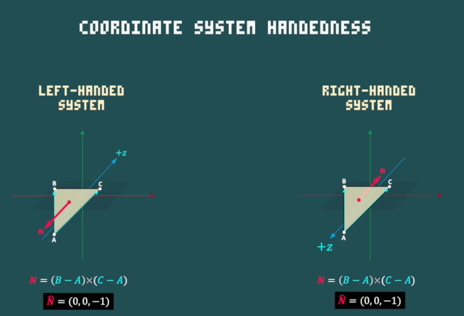 


## Dedicated Graphics Cards

https://www.youtube.com/watch?v=ZdITviTD3VM

- CPU
  - Limited number of cores
  - 각 코어는 복잡한 연산 가능
  - 코어는 전용(dedicated)이며 빠릅니다.
  - Good for computing single fast tasks
  - Optimized for serial tasks

- GPU
  - Tens/ thousands of cores
  - Dumb cores
  - Cores are limited in processing power
  - Good for multiple simple parallel tasks
  - Optimized for many paralle tasks


## Modern Graphics APIs & Shaders

- OpenGL
- Vulkan
- DirectX


Graphics pipeline

- Application
- Geometry -  vertex shader
- Rasterization - pixel shader
- Screen


Programmable Pipeline (Shader)

- vertex shader
  - A script responsible for manipulating vertices
    - Scale (per vertex)
    - Rotation
    - Translation
- pixel(fragment) shader
  - A script responsible for manipulating pixels
    - light effect (per pixel)
    - solid color
    - Texture


# 버그 수정

1. vector.c 오타

```c++
void vec3_normalize(vec3_t* v)
{
      float length = sqrt(v->x * v->x + v->y * v->y + v->z * v->z);
      v->x /= length;
      v->y /= length;
      v->z /= length;
}
```

- =을 빼먹어서 잘못된 계산이 누적되어 픽셀 찍을 때 함수 draw_triangle_pixel or draw_triangle_texel의 z_buffer버퍼에서 런타임 에러

2. double free 
destroy_window, free_resources에서 color_buffer버퍼를 두 번 해제
